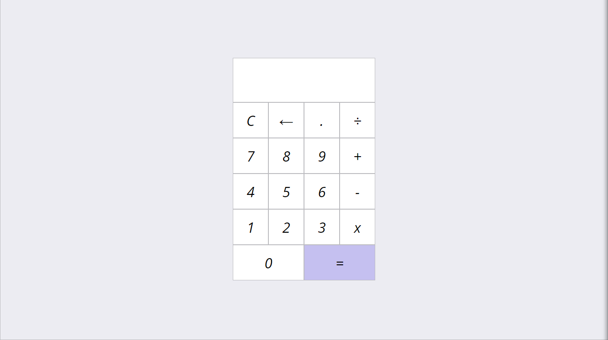

### Github Pages:
https://raphaelmmachado.github.io/calculator/
## Screenshot

# Calculator
I made a simple calculator without using eval.
It does the four basic math operations.
I learned many things while building it and it gave me a lot of confidence to continue.

### Built with
- HTML
- CSS
- Javascript

### What I learned
- Grid Template
- Value and reference in javascript
- Scopes
- EventListeners
___________________________________________________
# Calculadora
Eu fiz uma calculadora simples sem usar "eval".
Ela faz as quatro operações matemáticas básicas.
Eu aprendi muito enquanto criava e isso me deu bastante confiança para continuar.

### Feito com:
- HTML
- CSS
- Javascript

### O que eu aprendi:
- Grid template
- Valores e referência no javascript
- Escopos
- EventListerners
